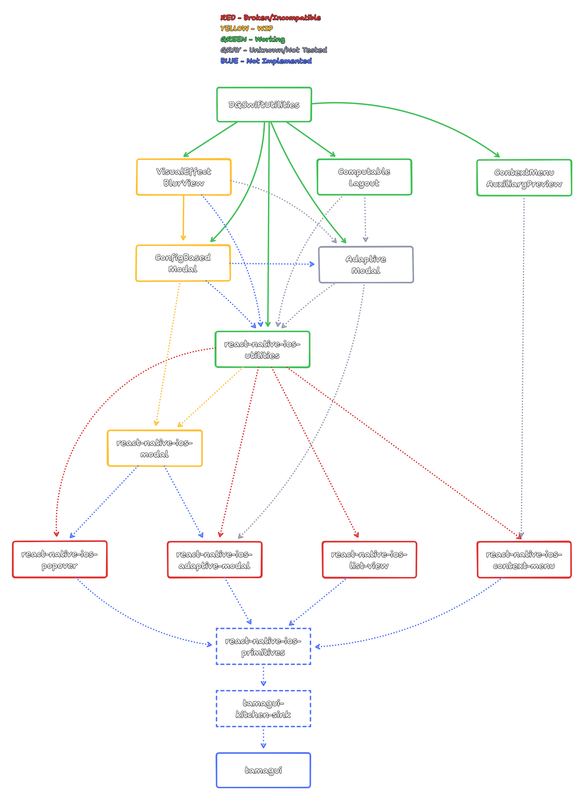

# react-native-ios-primitives

Native components for `react-native` (WIP + placeholder for now, please see [question and answers section](#Question-and-Answers) for more info).

  

## Dependencies

* [dependency graph](https://www.tldraw.com/s/v2_c_DwKqcmPS397EanWmdqSLy?v=-580,-145,2587,1592&p=page)
* SPM + Cocoapods libraries:
  * [`DGSwiftUtilities`](https://github.com/dominicstop/DGSwiftUtilities), [`VisualEffectBlurView`](https://github.com/dominicstop/VisualEffectBlurView), [`ComputableLayout`](https://github.com/dominicstop/ComputableLayout), [`ContextMenuAuxiliaryPreview`](https://github.com/dominicstop/ContextMenuAuxiliaryPreview), [`ConfigBasedModal`](https://github.com/dominicstop/ConfigBasedModal), [`AdaptiveModal`](https://github.com/dominicstop/adaptive-modal)  
* `react-native` libraries:
  * [`react-native-ios-utilities`](https://github.com/dominicstop/react-native-ios-utilities), [`react-native-ios-modal`](https://github.com/dominicstop/react-native-ios-modal), [`react-native-ios-adaptive-modal`](https://github.com/dominicstop/react-native-ios-adaptive-modal), [`react-native-ios-popover`](https://github.com/dominicstop/react-native-ios-popover), [`react-native-ios-context-menu`](https://github.com/dominicstop/react-native-ios-context-menu), [`react-native-ios-list-view`](https://github.com/dominicstop/react-native-ios-list-view)

 

## Question and Answers

* **Question**: What is this library?
  * **Answer**: This is meant to be an "entry point" for all the libraries listed in the [dependencies section](#dependencies); the purpose of this library is to ensure that the dependencies are compatible/work with each other, and reduce duplicated code.  
* **Question**: honey, why not just put everything into one big monorepo? this seems unnecessarily messy idk
  * **Answer**: i agree sm 😭, however i do not have the knowledge and resources required to create and maintain a monorepo that has multiple languages (e.g. swift/c++/objc/typescript), and packagers (e.g. npm/cocoapods/SPM); this is the best i can do for now sorry  
* **Question**: ok, i understand; are there at least any benefits of separating the dependencies out?
  * **Answer**: yeah—although it's a versioning and maintenance nightmare—I am at least able to create an example for each library so i can test and if they're working or not, while at the same time being able to isolate whether a bug is caused by `react-native`, or from `UIKit`.  
* **Question**: Why use this library, instead of directly using the dependencies?
  * **Answer**: The libraries listed in the [dependencies section](#dependencies) have different versions, and it's kind of hard to keep track which libraries are compatible with each other; using this "wrapper" library instead makes sure the correct version for all the dependencies is installed. 
  * Although i try my best to follow the "semantic versioning" guidelines, i make mistakes sometimes, and introduce breaking changes accidentally; this causes a cascade/domino effect where i unknowingly break the other libraries.  
* **Question**: Aside from being a "wrapper" library for "unifying" the dependencies and their different versions (and ensuring that they are compatible w/ one another), what else does this library do?
  * **Answer**: Create components that utilize the native `UIKit` primitives and API's, e.g.: combining `react-native-ios-adaptive-modal` (to create a sheet), `react-native-ios-list-view` (to create a grid), and `PHPhotoLibrary` to make a custom image picker, etc.  
* **Question**: gurl, why is there a [sponsor button](https://github.com/sponsors/dominicstop)? it's giving greedy tbh
  * **Answer**: you don't have to, but it would be nice of you, if you did 🥺👉👈
  * i'm just trying things out; this is mostly just for people (and organizations) who have the extra means to do so.
  * Special thanks to [@junzhengca](https://github.com/junzhengca) for opening this [issue](https://github.com/dominicstop/react-native-ios-context-menu/issues/104) regarding financially supporting `react-native-ios-modal`, and becoming my 2nd sponsor 🥺.
  * Special thanks to [@natew](https://github.com/natew/natew) for becoming my 1st sponsor, and funding the work needed to make the libraries listed in the [dependencies section](#dependencies) work together.  
* **Question**: Is there a way to track the progress?
  * **Answer**: I try my best to track progress at this [gist](https://gist.github.com/dominicstop/0dc1f56b14d6e96e4755398afbdb8caf) — it contains a timeline/log of the things i am currently working on.
